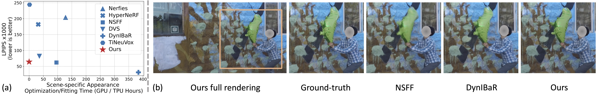

<h1 align="center">Pseudo-Generalized Dynamic View Synthesis</h1>

<p align="center"><b>ICLR 2024</b></p>

<p align="center">
  
</p>

**Pseudo-Generalized Dynamic View Synthesis from a Video, ICLR 2024.**<br>
[Xiaoming Zhao](https://xiaoming-zhao.com/), [Alex Colburn](https://www.colburn.org/), [Fangchang Ma](https://fangchangma.github.io/), [Miguel Ángel Bautista](https://scholar.google.com/citations?user=ZrRs-qoAAAAJ&hl=en), [Joshua M Susskind](https://scholar.google.com/citations?user=Sv2TGqsAAAAJ&hl=en), and [Alexander G. Schwing](https://www.alexander-schwing.de/). 

### Project Page | Paper

## Table of Contents

- [Environment Setup](#environment-setup)
- [Try PGDVS on Video in the Wild](#try-pgdvs-on-video-in-the-wild)
- [Benchmarking](#benchmarking)
- [Citation](#citation)
- [License](#license)
- [Acknowledgements](#acknowledgements)

## Environment Setup

This code has been tested on Ubuntu 20.04 with CUDA 11.8 on NVIDIA A100-SXM4-80GB GPU (driver 470.82.01).

We recommend using `conda` for virtual environment control and [`libmamba`](https://www.anaconda.com/blog/a-faster-conda-for-a-growing-community) for a faster dependency check.

```bash
# setup libmamba
conda install -n base conda-libmamba-solver -y
conda config --set solver libmamba

# create virtual environment
conda env create -f envs/pgdvs.yaml

conda activate pgdvs
conda install pytorch3d=0.7.4 -c pytorch3d -y
```

**[optional]** Run the following to install JAX if you want to 
1. try [TAPIR](https://github.com/google-deepmind/tapnet)
2. evaluate with metrics computation from [DyCheck](https://github.com/KAIR-BAIR/dycheck)
```bash
conda activate pgdvs
pip install -r envs/requirements_jax.txt --verbose
```
To check that JAX is installed correctly, run the following.
**NOTE**: the first `import torch` is important since it will make sure that JAX finds the cuDNN installed by `conda`.
```bash
conda activate pgdvs
python -c "import torch; from jax import random; key = random.PRNGKey(0); x = random.normal(key, (10,)); print(x)"
```

## Try PGDVS on Video in the Wild

### Download Checkpoints

```bash
# this environment variable is used for demonstration
cd /path/to/this/repo
export PGDVS_ROOT=$PWD
```

Since we use third parties's pretrained models, we provide two ways to download them:
1. Directly download from those official repositories;
2. Download from our copy for reproducing results in the paper just in case those official repositories's checkpoints are modified in the future.
```bash
FLAG_ORIGINAL=1  # set to 0 if you want to download from our copy
bash ${PGDVS_ROOT}/scripts/download_ckpts.sh ${PGDVS_ROOT}/ckpts ${FLAG_ORIGINAL}
```

### Example of DAVIS

We use [DAVIS](https://davischallenge.org/) as an example to illustrate how to render novel view from monocular videos in the wild. Please see [IN_THE_WILD.md](./docs/IN_THE_WILD.md) for details.


## Benchmarking

Please see [BENCHMARK_NVIDIA.md](./docs/BENCHMARK_NVIDIA.md) and [BENCHMARK_iPhone.md](./docs/BENCHMARK_iPhone.md)  for details about reproducing results on [NVIDIA Dynamic Scenes](https://gorokee.github.io/jsyoon/dynamic_synth/) and [DyCheck's iPhone Dataset](https://github.com/KAIR-BAIR/dycheck) in the paper.

## Citation
>Xiaoming Zhao, Alex Colburn, Fangchang Ma, Miguel Ángel Bautista, Joshua M Susskind, and Alexander G. Schwing. Pseudo-Generalized Dynamic View Synthesis from a Video. ICLR 2024.
```
@inproceedings{Zhao2024PGDVS,
  title={{Pseudo-Generalized Dynamic View Synthesis from a Video}},
  author={Xiaoming Zhao and Alex Colburn and Fangchang Ma and Miguel Angel Bautista and Joshua M. Susskind and Alexander G. Schwing},
  booktitle={ICLR},
  year={2024},
}
```

## License

This sample code is released under the [LICENSE](./LICENSE) terms.

## Acknowledgements

Our project is not possible without the following ones:
- [GNT](https://github.com/VITA-Group/GNT) (commit `7b63996cb807dbb5c95ab6898e8093996588e73a`)
- [RAFT](https://github.com/princeton-vl/RAFT) (commit `3fa0bb0a9c633ea0a9bb8a79c576b6785d4e6a02`)
- [OneFormer](https://github.com/SHI-Labs/OneFormer) (commit `56799ef9e02968af4c7793b30deabcbeec29ffc0`)
- [segment-anything](https://github.com/facebookresearch/segment-anything) (commit `6fdee8f2727f4506cfbbe553e23b895e27956588`)
- [ZoeDepth](https://github.com/isl-org/ZoeDepth) (commit `edb6daf45458569e24f50250ef1ed08c015f17a7`)
- [TAPIR](https://github.com/deepmind/tapnet) (commit `4ac6b2acd0aed36c0762f4247de9e8630340e2e0`)
- [CoTracker](https://github.com/facebookresearch/co-tracker) (commit `0a0596b277545625054cb041f00419bcd3693ea5`)
- [casualSAM](https://github.com/ztzhang/casualSAM) (we use [our modified version](https://github.com/Xiaoming-Zhao/casualSAM))
- [dynamic-video-depth](https://github.com/google/dynamic-video-depth) (we use [our modified version](https://github.com/Xiaoming-Zhao/dynamic-video-depth))